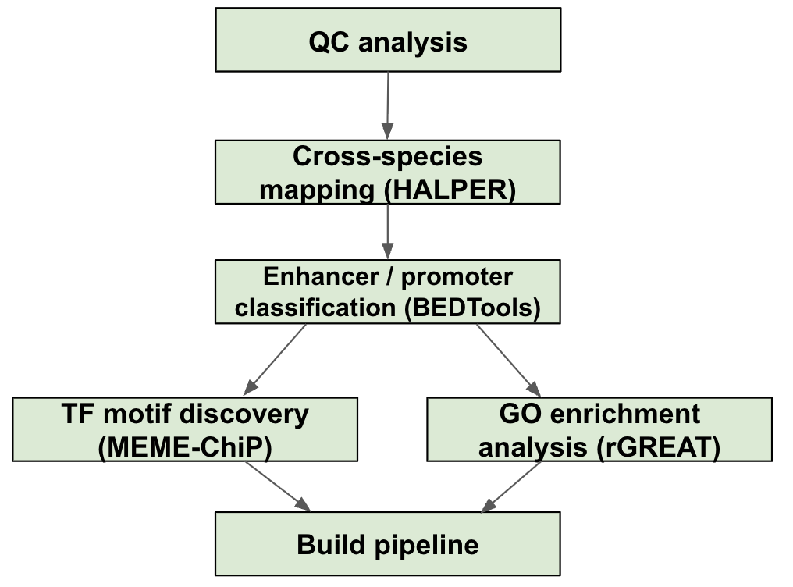

# ***T***ranscription ***R***egulatory ***A***nalysis of ***C***onserved ***E***lements (***TRACE***)


***TRACE*** - A cross-species regulatory genomics pipeline for comparing open chromatin regions (OCRs) between human and mouse liver tissue using ATAC-seq data. The pipeline maps OCRs across species, classifies them as enhancers or promoters, identifies enriched biological processes, and discovers over-represented sequence motifs.

Developed for **03-713: Bioinformatics Data Integration Practicum**, Spring 2026, Carnegie Mellon University.

---

## Citation

If you use this repository, please cite:

**Evan Lin, Arun Sujatha Bharath Raj, Nikita Rajesh, Suratha Sriram**
(2026). *TRACE: Transcription Regulatory Analysis of Conserved Elements*.
03-713: Bioinformatics Data Integration Practicum,
Carnegie Mellon University

---

## Dependencies:

| Tool | Version | Purpose |
|------|---------|---------|
| [HALPER](https://github.com/pfenninglab/halLiftover-postprocessing) | - | Cross-species liftover of OCRs |
| ↳ Python 3 *(via `hal` conda env)* | ≥ 3.6 | Required internally by HALPER - see [HAPLER installation](https://github.com/pfenninglab/halLiftover-postprocessing) |
| [bedtools](https://bedtools.readthedocs.io/en/latest/) | ≥ 2.31 | Genomic interval operations |
| [rGREAT](https://github.com/jokergoo/rGREAT) | ≥ 2.0 | GO enrichment analysis of genomic regions |
| [ggplot2](https://ggplot2.tidyverse.org/) | ≥ 3.3 | Visualization of rGREAT results |
| R | ≥ 4.0 | Required for rGREAT and ggplot2 |
| [MEME-ChIP](https://meme-suite.org/meme/tools/meme-chip) | 5.4.1 | Motif enrichment analysis |

> **Note:** All scripts are designed to run on the [Pittsburgh Supercomputing Center (PSC) Bridges-2](https://www.psc.edu/resources/bridges-2/) cluster. Tools are loaded via the `module` system. Running locally will require manual installation of all dependencies and may require minor path adjustments in the scripts.

## Installation

### On Bridges-2 (PSC) - recommended

Tools are available as modules on Bridges-2. No manual installation needed for most dependencies:

```bash
module load bedtools/2.31.0
module load MEME-suite/5.4.1
module load anaconda3
```

For HALPER and rGREAT, set up once:

```bash
# HALPER - clone and set up conda environment
# Follow: https://github.com/pfenninglab/halLiftover-postprocessing

# rGREAT - install inside your R environment
conda activate rgreat_env
Rscript -e "BiocManager::install('rGREAT')"
Rscript -e "BiocManager::install('org.Mm.eg.db')"
```

Then clone the repo:

```bash
git clone https://github.com/BioinformaticsDataPracticum2026/liver-ATAC-OCR.git
cd liver-ATAC-OCR
```

### Local installation

If running outside Bridges-2, install all dependencies manually:

```bash
# bedtools
conda install -c bioconda bedtools

# rGREAT (in R)
RScript -e "BiocManager::install('rGREAT')"
RScript -e "BiocManager::install('org.Mm.eg.db')"

# HALPER
# Follow instructions at: https://github.com/pfenninglab/halLiftover-postprocessing

# MEME-ChIP
# Follow instructions at: https://meme-suite.org/meme/doc/install.html
```

> Minor path adjustments in the scripts may be required when running locally.

---

## Pipeline Overview
 
The pipeline addresses the following biological questions:
- To what extent is transcriptional regulatory activity conserved between human and mouse liver?
- How does conservation differ between enhancers and promoters?
- What biological processes are regulated by shared vs. species-specific OCRs?
- How does the regulatory code (TF motifs) differ between species, and between enhancers and promoters?



### Task 1 — Quality Control
 
ATAC-seq data from human and mouse liver and adrenal gland tissues were evaluated across seven QC metrics: % mapped reads, % properly paired reads, periodicity plots, TSS enrichment score, NRF, rescue ratio, and self-consistency ratio. The tissue with the highest-quality human and mouse datasets was selected for all downstream analyses.
 
### Task 2 — Cross-Species Liftover (HALPER)
 
Human liver OCRs are mapped to the mouse genome using HALPER, which leverages whole-genome alignments from the Cactus HAL file. Each human OCR is assigned an orthologous region in the mouse genome. OCRs are then classified as: **shared** (ortholog is open in mouse), or **human-specific** (ortholog is closed in mouse). Mouse-native OCRs with no human ortholog are classified as **mouse-specific**.

### Task 3 — Promoter / Enhancer Classification
 
OCRs are classified as promoter-like or enhancer-like based on proximity to annotated transcription start sites (TSS ± 2 kb, from GENCODE vM15). Regions overlapping a TSS window are called promoters; all others are called enhancers. This classification is applied to shared, human-specific, and mouse-specific OCR sets.
 
### Task 4 — Biological Process Enrichment (rGREAT)
 
GO biological process enrichment is performed using rGREAT on five sets of OCRs: all human OCRs, all mouse OCRs, shared OCRs, human-specific OCRs, and mouse-specific OCRs. rGREAT assigns regions to nearby genes based on genomic distance and tests for overrepresented GO terms. Results are filtered at adjusted p-value < 0.05.
 
### Task 5 — Motif Analysis (MEME-ChIP)
 
MEME-ChIP is run on FASTA sequences extracted from seven OCR sets: human enhancers, mouse enhancers, human promoters, mouse promoters, shared enhancers, human-specific enhancers, and mouse-specific enhancers. Sequences are resized to ±100 bp windows around peak midpoints. Discovered motifs are compared against the JASPAR 2026 vertebrates database to identify enriched transcription factor binding sites.
 
---

## Usage

### Inputs

| Input Filename | Step | Description |
|----------------|------|-------------|
| `human_liver.narrowPeak.gz` | Task 2 | Human liver OCRs |
| `mouse_liver.narrowPeak.gz` | Task 2 | Mouse liver OCRs |
| `10plusway-master.hal` | Task 2 | HAL alignment file for liftover |
| ```gencode.vM15.annotation.protTranscript\n.geneNames_TSSWithStrand_sorted.bed``` | Task 3 | TSS annotation file |
| `human_liver.HumanToMouse.HALPER.narrowPeak.gz` | Task 3 | HALPER liftover output (human OCRs mapped to mouse) |
| `idr.conservative_peak.narrowPeak.gz` | Task 3 | Mouse Peak file |
| `human_liver.narrowPeak` | Task 4 | Human OCRs for rGREAT |
| `mouse_liver.narrowPeak` | Task 4 | Mouse OCRs for rGREAT |
| `shared_open.bed` | Task 4 | Shared OCRs for rGREAT |
| `human_open_mouse_closed.bed` | Task 4 | Human-specific OCRs for rGREAT |
| `mouse_open_human_closed.bed` | Task 4 | Mouse-specific OCRs for rGREAT |
| `shared_enhancer.bed` | Task 5 | Shared enhancer OCRs for motif analysis |
| `human_specific_enhancer.bed` | Task 5 | Human-specific enhancer OCRs for motif analysis |
| `mouse_specific_enhancer.bed` | Task 5 | Mouse-specific enhancer OCRs for motif analysis |
| `mm10.fa` | Task 5 | mm10 genome FASTA |
| `JASPAR2026_vertebrates_combined.meme` | Task 5 | JASPAR motif database for MEME-ChIP |

### Run the full pipeline (Tasks 2-5)

```bash
bash scripts/TRACE_pipeline.sh \
    --human /path/to/human_liver.narrowPeak.gz \
    --mouse /path/to/mouse_liver.narrowPeak.gz \
    --hal /path/to/10plusway-master.hal \
    --tss /path/to/gencode.vM15.annotation.protTranscript.geneNames_TSSWithStrand_sorted.bed \
    --genome /path/to/mm10.fa \
    --jaspar /path/to/JASPAR2026_vertebrates_combined.meme
```

### Available flags

| Flag | Description | Default |
|------|-------------|---------|
| `--human` | Human ATAC-seq peak file (.narrowPeak.gz) | - |
| `--mouse` | Mouse ATAC-seq peak file (.narrowPeak.gz) | - |
| `--hal` | HAL alignment file | - |
| `--tss` | TSS annotation BED file | - |
| `--genome` | mm10 genome FASTA | - |
| `--jaspar` | JASPAR motif database (.meme) | - |
| `--source-species` | Liftover source species | `Human` |
| `--target-species` | Liftover target species | `Mouse` |
| `--conda-env` | Conda environment for rGREAT | `rgreat_env` |
| `--skip-halper` | Skip liftover step | - |
| `--skip-pe` | Skip P/E classification step | — |
| `--skip-great` | Skip rGREAT steps | — |
| `--skip-motif` | Skip motif analysis step | — |
| `-h`, `--help` | Show this help message and exit | - |

### Run individual steps

```bash
bash scripts/run_halper_mapping.sh     # Task 2: HALPER mapping
bash scripts/run_pe_classification.sh  # Task 3: P/E classification
bash scripts/run_rgreat.sh             # Task 4: rGREAT enrichment
bash scripts/run_plots.sh              # Task 4: rGREAT plots
bash scripts/run_motif_analysis.sh     # Task 5: Motif enrichment
```

### External tool documentation

- HALPER: https://github.com/pfenninglab/halLiftover-postprocessing
- rGREAT: https://github.com/jokergoo/rGREAT
- MEME-ChIP: https://meme-suite.org/meme/tools/meme-chip

### Saving outputs

All results are written automatically to their respective output directories. To archive:

```bash
tar -czvf results_backup.tar.gz Mapping/outputs PE_classification/output rGREAT/outputs Motif_analysis/outputs
```

---

## Output

| Directory | Contents |
|-----------|----------|
| `Mapping/outputs/` | HALPER liftover result (`*.HALPER.narrowPeak.gz`) |
| `PE_classification/outputs/rowcount/summary.tsv` | Enhancer/promoter counts (raw) |
| `PE_classification/outputs/unique/summary.tsv` | Enhancer/promoter counts (deduplicated) |
| `rGREAT_Analysis/outputs/plots/` | Barplots and comparison heatmap (`.png`) |
| `Motif_analysis/outputs/meme_chip_human_specific_enhancer/` | `summary.tsv` + `meme-chip.html` |
| `Motif_analysis/outputs/meme_chip_mouse_specific_enhancer/` | `summary.tsv` + `meme-chip.html` |
| `logs/` | Timestamped per-step log files |

---

## Repository Structure

```
liver-ATAC-OCR/
├── scripts/
│   ├── TRACE_pipeline.sh
│   ├── run_halper_mapping.sh
│   ├── run_pe_classification.sh
│   ├── run_rgreat.sh
│   ├── run_plots.sh
│   └── run_motif_analysis.sh
├── rGREAT_Analysis/
│   ├── scripts/
│   │   ├── rgreat_analysis.R
│   │   └── rgreat_plots.R
│   └── outputs/
├── Mapping/outputs/
├── PE_classification/
│   ├── input/
│   └── outputs/
├── Motif_analysis/outputs/
├── docs/QC_Analysis.md
├── README.md
├── requirements.txt
├── .gitignore
└── LICENSE
```

---

## References

1. Amemiya, H.M. et al. (2019). The ENCODE Blacklist: Identification of Problematic Regions of the Genome. Scientific Reports 9, 9354.
2. Ji, Z. et al. (2020). Multi-scale chromatin state annotation using a hierarchical hidden Markov model. Biochim Biophys Acta Gene Regul Mech, 1863(6):194551.
3. Kaplow, I.M. et al. (2022). Relating enhancer genetic variation across mammals to complex phenotypes using linear mixed models. BMC Genomics 23, 307.
4. Landt, S.G. et al. (2012). ChIP-seq guidelines and practices of the ENCODE and modENCODE consortia. Genome Research 22, 1813–1831.
5. Langmead, B. & Salzberg, S.L. (2012). Fast gapped-read alignment with Bowtie 2. Nature Methods 9, 357–359.
6. Li, Q. et al. (2011). Measuring reproducibility of high-throughput experiments. Annals of Applied Statistics 5(3), 1752–1779.
7. Zhang, Y. et al. (2008). Model-based Analysis of ChIP-Seq (MACS). Genome Biology 9, R137.
8. Diehl, A.G. et al. (2020). HALPER: a tool for cross-species liftover of ATAC-seq peaks. *Bioinformatics*. https://doi.org/10.1093/bioinformatics/btaa493
9. Quinlan, A.R. & Hall, I.M. (2010). BEDTools: a flexible suite of utilities for comparing genomic features. *Bioinformatics* 26(6):841–842. https://doi.org/10.1093/bioinformatics/btq033
10. McLean, C.Y. et al. (2010). GREAT improves functional interpretation of cis-regulatory regions. *Nature Biotechnology* 28, 495–501. https://doi.org/10.1038/nbt.1630
11. Gu, Z. & Hübschmann, D. (2023). rGREAT: an R/Bioconductor package for functional enrichment of genomic regions. *Bioinformatics* 39(1). https://doi.org/10.1093/bioinformatics/btac745
12. Machanick, P. & Bailey, T.L. (2011). MEME-ChIP: motif analysis of large DNA datasets. *Bioinformatics* 27(12):1696–1697. https://doi.org/10.1093/bioinformatics/btr189
13. Bailey, T.L. et al. (2015). The MEME Suite. *Nucleic Acids Research* 43(W1):W39–49. https://doi.org/10.1093/nar/gkv416
14. Villar, D. et al. (2015). Enhancer evolution across 20 mammalian species. *Cell* 160(3):554–566. https://doi.org/10.1016/j.cell.2015.01.006
15. Ballester, B. et al. (2014). Multi-species, multi-transcription factor binding highlights conserved control of tissue-specific biological pathways. *eLife* 3:e02626. https://doi.org/10.7554/eLife.02626
16. Yue, F. et al. (2014). A comparative encyclopedia of DNA elements in the mouse genome. *Nature* 515, 355–364. https://doi.org/10.1038/nature13992
17. Wahli, W. & Michalik, L. (2012). PPARs at the crossroads of lipid signaling and inflammation. *Trends in Endocrinology & Metabolism* 23(7):351–363. https://doi.org/10.1016/j.tem.2012.05.001
18. Rui, L. (2014). Energy Metabolism in the Liver. *Comprehensive Physiology* 4(1):177–197. https://doi.org/10.1002/cphy.c130024
19. Lu, S.C. (2009). Regulation of Glutathione Synthesis. *Molecular Aspects of Medicine* 30(1-2):42–59. https://doi.org/10.1016/j.mam.2008.05.005
20. Duester, G. (2008). "Retinoic Acid Synthesis and Signaling during Early Organogenesis." Cell 134(6):921–931. https://doi.org/10.1016/j.cell.2008.09.002
21. Blaner, W.S. et al. (2009). Hepatic stellate cell lipid droplets: A specialized lipid droplet for retinoid storage. *Biochimica et Biophysica Acta* 1791(6):467–473. https://doi.org/10.1016/j.bbalip.2008.11.001
22. Dzierzak, E. & Philipsen, S. (2013). Erythropoiesis: Development and Differentiation. *Cold Spring Harbor Perspectives in Medicine* 3(4). https://doi.org/10.1101/cshperspect.a011601
23. Tappy, L. & Lê, K.A. (2010). "Metabolic Effects of Fructose and the Worldwide Increase in Obesity." Physiological Reviews 90(1):23–46. https://doi.org/10.1152/physrev.00019.2009 
24. Ong, C.T. & Corces, V.G. (2014). CTCF: an architectural protein bridging genome topology and function. *Nature Reviews Genetics* 15, 234–246. https://doi.org/10.1038/nrg3663
25. Schmidt, D. et al. (2012). Waves of retrotransposon expansion remodel genome organization and CTCF binding in multiple mammalian lineages. *Cell* 148(1-2):335–348. https://doi.org/10.1016/j.cell.2011.11.058
26. Pawlak, M. et al. (2015). Molecular mechanism of PPARα action and its impact on lipid metabolism, inflammation and fibrosis in non-alcoholic fatty liver disease. *Journal of Hepatology* 62(3):720–733. https://doi.org/10.1016/j.jhep.2014.10.039
27. Lefebvre, P. et al. (2006). Sorting out the roles of PPARα in energy metabolism and vascular homeostasis. *Journal of Clinical Investigation* 116(3):571–580. https://doi.org/10.1172/JCI27989
28. Suske, G. (1999). The Sp-family of transcription factors. *Gene* 238(2):291–300. https://doi.org/10.1016/S0378-1119(99)00357-1
29. Golson, M.L. & Kaestner, K.H. (2016). Fox transcription factors: from development to disease. *Development* 143(24):4558–4570. https://doi.org/10.1242/dev.112672
30. McConnell & Yang (2010) — "Mammalian Krüppel-Like Factors in Health and Disease." Physiological Reviews 90(4):1337–1381. https://doi.org/10.1152/physrev.00058.2009
31. Hayhurst et al. (2001) — "Hepatocyte nuclear factor 4α is essential for maintenance of hepatic gene expression." Molecular and Cellular Biology 21(4):1393–1403. https://doi.org/10.1128/MCB.21.4.1393-1403.2001
32. Barish et al. (2006) — "PPARδ: a dagger in the heart of the metabolic syndrome." Journal of Clinical Investigation 116(3):590–597. https://doi.org/10.1172/JCI27955
33. Mangelsdorf & Evans (1995) — "The RXR heterodimers and orphan receptors." Cell 83(6):841–850. https://doi.org/10.1016/0092-8674(95)90200-7
34. Ramji & Foka (2002) — "CCAAT/enhancer-binding proteins: structure, function and regulation." Biochemical Journal 365(3):561–575. https://doi.org/10.1042/BJ20020508
35. Cereghini (1996) — "Liver-enriched transcription factors and hepatocyte differentiation." FASEB Journal 10(2):267–282. https://doi.org/10.1096/fasebj.10.2.8641560

---

## Contact

**Evan Lin** - evanlin@andrew.cmu.edu

**Arun Sujatha Bharath Raj** - asujatha@andrew.cmu.edu

**Nikita Rajesh** - nrajesh@andrew.cmu.edu

**Suratha Sriram** - surathas@andrew.cmu.edu

---

## License:
This project is licensed under the MIT License - see the [LICENSE](LICENSE) file for details

---