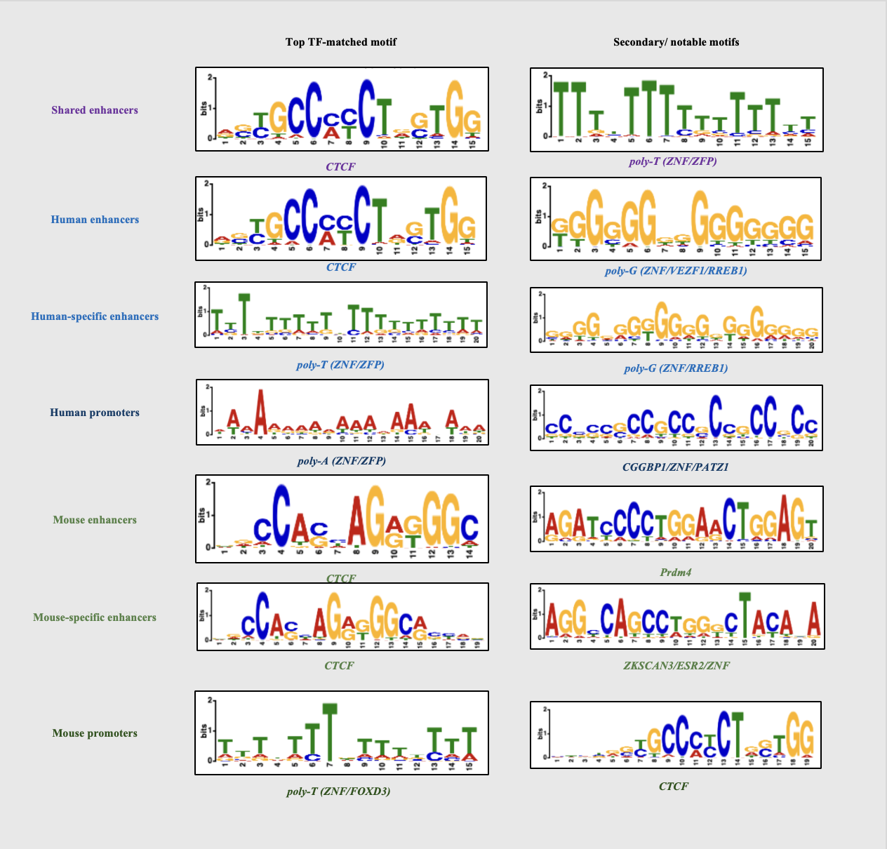

# Results

## QC Analysis

| Metric | Mouse Liver Replicate 1 | Mouse Liver Replicate 2 | Human Liver Replicate 1 | Human Liver Replicate 2 | Mouse Adrenal Gland Replicate 1 | Mouse Adrenal Gland Replicate 2 | Human Adrenal Gland Replicate 1 | Human Adrenal Gland Replicate 2 |
| --- | --- | --- | --- | --- | --- | --- | --- | --- |
| % Mapped Reads (%) | $\color{green}97.8$ | $\color{green}97.89999999999999$ | $\color{green}98.9$ | $\color{green}98.6$ | $\color{green}98.5$ | $\color{green}98.6$ | $\color{green}98.5$ | $\color{green}98.9$ |	
| % Properly Paired Reads (%) | $\color{green}95.7$ | $\color{green}95.6$ | $\color{green}97.89999999999999$ | $\color{green}97.5$ | $\color{green}94.6$ | $\color{green}94.6999999999999$ | $\color{green}97.0$ | $\color{green}97.5$ |
| Periodicity Plots | $\color{green}3 \text{ Clear, distinct}$ $\color{green} \text{humps}$ | $\color{green}3 \text{ Clear, distinct}$ $\color{green} \text{humps}$ | $\color{green}3 \text{ Clear, distinct}$ $\color{green} \text{humps}$ | $\color{green}3 \text{ Clear, distinct}$ $\color{green} \text{humps}$ | $\color{yellow}2 \text{ Clear, distinct}$ $\color{yellow} \text{humps}$ | $\color{yellow}2 \text{ Clear, distinct}$ $\color{yellow} \text{humps}$ | $\color{yellow}2 \text{ Clear and distinct}$ $\color{yellow} \text{humps}$ | $\color{yellow}2 \text{ Clear and distinct}$ $\color{yellow} \text{humps}$ |
| TSS-Enrichment Score | $\color{yellow}7.692382151686117$ | $\color{yellow}7.354598361825624$ | $\color{green}23.294805448649445$ | $\color{green}20.962438980086663$ | $\color{green}18.365117628803656$ | $\color{green}18.997852749462098$ | $\color{green}26.084253634636482$ | $\color{green}14.011771178374902$ |
| NRF (Non-Redundant Fraction) | $\color{green}0.935887$ | $\color{green}0.94404$ | $\color{green}0.884593$ | $\color{green}0.899531$ | $\color{red}0.301612$ | $\color{red}0.270462$ | $\color{yellow}0.778014$ | $\color{green}0.969527$ |
| Rescue Ratio | $\color{green}1.0043626038838573$ | $\color{green}1.0122929315643505$ | $\color{green}1.0906310179587084$ | $\color{green}1.24175568252391$ | $\color{green}1.013263779368353$ | $\color{green}1.0098552058921995$ | $\color{red}2.0842882741797046$ | $\color{red}4.283663165487085$ |
| Self-consistency Ratio | $\color{green}1.0756982081825852$ | $\color{green}1.1043673083661616$ | $\color{green}1.2192105681999046$ | $\color{green}1.4284339019600292$ | $\color{green}1.2220589050973432$ | $\color{green}1.2891362811933205$ | $\color{red}3.6038942470169237$ | $\color{red}6.26995057660626$ |
| Reproducibility Test | $\color{green}\text{Pass}$ | $\color{green}\text{Pass}$ | $\color{green}\text{Pass}$ | $\color{green}\text{Pass}$ | $\color{green}\text{Pass}$ | $\color{green}\text{Pass}$ | $\color{red}\text{Fail}$ | $\color{red}\text{Fail}$ |

> \color{green} =  Passes threshold — \color{yellow} = Marginal — \color{red} = Fails threshold

## rGREAT Analysis

## MEME-ChIP Analysis

### Top TF-matched MEME motif (left) and secondary motif (right) per OCR category. Letter height ∝ information content (bits). Rank tag in corner; TF matched via TomTom/JASPAR 2026 [Only known motifs]
